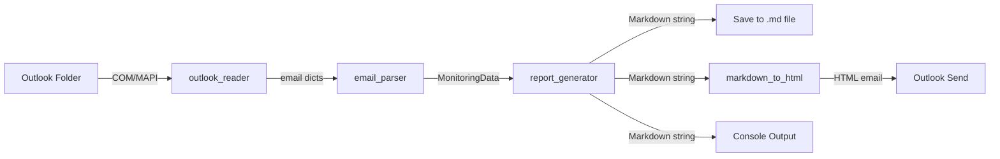

# 📘 Friday Monitoring Summary Agent — Technical Documentation

> **Version:** 1.0  
> **Platform:** Windows + Microsoft Outlook (Desktop)  
> **Language:** Python 3.8+  
> **Purpose:** Reads DBA monitoring emails from an Outlook folder, parses storage metrics (tablespace / ASM diskgroup / mount point), categorizes them by severity, builds a formatted Markdown report, saves it, and emails it back.

---

## 1. 📑 Table of Contents

1. [Overview](#2--overview)
2. [Architecture](#3--architecture)
3. [Data Flow](#4--data-flow)
4. [Module Reference](#5--module-reference)
5. [Data Models](#6--data-models)
6. [Severity Thresholds](#7--severity-thresholds)
7. [Command-Line Interface](#8--command-line-interface)
8. [Configuration](#9--configuration)
9. [Output Format](#10--output-format)
10. [Error Handling](#11--error-handling)
11. [Extending the Agent](#12--extending-the-agent)

---

## 2. 🎯 Overview

The agent automates the weekly DBA monitoring summary. Instead of manually reading several monitoring emails and compiling a status report, it:

| Stage | Action |
|-------|--------|
| **1. Connect** | Attaches to the running Outlook app via Windows COM (MAPI). |
| **2. Read** | Pulls emails from a target folder, filtered by date or subject keywords. |
| **3. Parse** | Extracts tablespace, diskgroup, and mount-point usage using regex. |
| **4. Categorize** | Buckets each metric into 🔴 Critical / 🟡 Warning / ✅ Stable. |
| **5. Report** | Generates a formatted Markdown summary. |
| **6. Deliver** | Saves the report to disk **and** emails it via Outlook. |

---

## 3. 🏗️ Architecture

```
┌──────────────────────────────────────────────────────────────────────┐
│                              main.py                                   │
│                      (Orchestrator / CLI)                              │
│                                                                        │
│   run_agent()  ──▶ list_outlook_folders()  ──▶ main()/argparse        │
└───────┬───────────────────┬───────────────────────┬──────────────────┘
        │                   │                        │
        ▼                   ▼                        ▼
┌───────────────┐   ┌────────────────┐      ┌────────────────────┐
│outlook_reader │   │ email_parser   │      │ report_generator   │
│───────────────│   │────────────────│      │────────────────────│
│ connect       │   │ parse_*_data   │      │ generate_*_section │
│ get_folder    │   │ classify_email │      │ categorize_by_     │
│ get_*_emails  │   │ parse_monitor- │      │   threshold        │
│ send_email    │   │   ing_emails   │      │ generate_full_     │
│ markdown_html │   │                │      │   report           │
└───────┬───────┘   └────────────────┘      └────────────────────┘
        │
        ▼
┌───────────────┐
│  MS Outlook   │
│ (COM / MAPI)  │
└───────────────┘
```

**Design principle:** A thin orchestrator (`main.py`) coordinates three single-responsibility modules — *read*, *parse*, *report*.

---

## 4. 🔄 Data Flow



**Email dictionary shape** (produced by `outlook_reader`):

```python
{
    "subject":       str,        # Email subject line
    "body":          str,        # Plain-text body
    "html_body":     str,        # HTML body (if available)
    "received_time": datetime,   # Received timestamp
    "sender":        str,        # Sender display name
}
```

---

## 5. 🧩 Module Reference

### 5.1 `main.py` — Orchestrator & CLI

| Function | Description |
|----------|-------------|
| `list_outlook_folders()` | Prints all Outlook folders (and item counts) for troubleshooting. |
| `run_agent(folder_name, target_date, output_file, days_back, send_to)` | Executes the full 5-step workflow: connect → read → parse → generate → deliver. |
| `main()` | Defines and parses CLI arguments, then dispatches to `run_agent()` or `list_outlook_folders()`. |

**Module constants:**
- `RECIPIENT_EMAIL` — default report recipient (`ajay.kumar@incedoinc.com`).
- `MONITORING_KEYWORDS` — subject keywords used to find monitoring emails.

---

### 5.2 `outlook_reader.py` — Outlook I/O

| Function | Returns | Description |
|----------|---------|-------------|
| `connect_outlook()` | MAPI namespace | Dispatches `Outlook.Application` and returns the MAPI namespace. Raises `ConnectionError` on failure. |
| `get_folder(namespace, folder_name, parent_folder)` | Folder object | Locates a folder by name — first under Inbox, then recursively across stores. Raises `FileNotFoundError` if missing. |
| `get_today_emails(folder, date)` | `list[dict]` | Returns emails received on a specific date (defaults to today). Relies on descending sort for early exit. |
| `get_friday_emails(folder)` | `list[dict]` | Returns emails from the most recent Friday. |
| `get_emails_by_subject(folder, subject_keywords, days_back)` | `list[dict]` | Returns emails within `days_back` whose subject matches any keyword. |
| `send_email(to_address, subject, body_markdown, body_html)` | `bool` | Creates and sends a `MailItem` via Outlook. Auto-converts Markdown → HTML when no HTML body is supplied. |
| `markdown_to_html(md_text)` | `str` | Converts the Markdown report into inline-styled HTML for clean Outlook rendering (headers, bullets, bold, code, emoji callouts). |

> **Note:** `GetDefaultFolder(6)` resolves to the **Inbox** (Outlook's `olFolderInbox` constant). `CreateItem(0)` creates a **MailItem** (`olMailItem`).

---

### 5.3 `email_parser.py` — Content Extraction

| Function | Returns | Description |
|----------|---------|-------------|
| `parse_tablespace_data(email_body)` | `list[TablespaceEntry]` | Extracts tablespace usage via three regex patterns (pipe-separated, named tablespaces, DB-context headers). |
| `parse_diskgroup_data(email_body)` | `list[DiskgroupEntry]` | Extracts ASM diskgroup usage (`DATA`, `FRA`, `REDO`, `ARCH`). |
| `parse_mount_point_data(email_body)` | `list[MountPointEntry]` | Extracts filesystem/mount usage from `df`-style or simplified rows. |
| `classify_email(subject)` | `str` | Classifies email type: `tablespace`, `diskgroup`, `mount_point`, `general`, or `unknown`. |
| `parse_monitoring_emails(emails)` | `MonitoringData` | Iterates all emails, dispatches to the correct parser(s), and aggregates results. |

**Parsing context awareness:** Parsers track a "current database/host" by detecting header lines like `Database: CDBPRD1` or section headers (`CDB…`, `CTS…`, `HFA…`, `GG…`) so each metric is attributed to its source.

---

### 5.4 `report_generator.py` — Report Building

| Function | Returns | Description |
|----------|---------|-------------|
| `categorize_by_threshold(entries, critical, warning)` | `tuple(list, list, list)` | Splits entries into critical / warning / stable groups by `used_percent`. |
| `generate_tablespace_section(tablespaces)` | `str` | Builds Section 1 (grouped by database, with observations). |
| `generate_diskgroup_section(diskgroups)` | `str` | Builds Section 2 (ASM, with FRA vs DATA grouping). |
| `generate_mount_point_section(mount_points, section_title, section_num)` | `str` | Builds a mount-point section (reused for PROD and DEV/TST). |
| `generate_alerts_section(data)` | `str` | Builds the consolidated "Overall Key Alerts" block. |
| `generate_health_summary(data)` | `str` | Builds the final DEV/TST vs PROD health verdict. |
| `generate_full_report(data, report_date)` | `str` | Assembles the complete Markdown report from all sections. |

---

## 6. 🗂️ Data Models

Defined in `email_parser.py` as `@dataclass` objects:

```python
@dataclass
class TablespaceEntry:
    database: str
    tablespace_name: str
    used_percent: float
    size_mb: float = 0
    free_mb: float = 0

@dataclass
class DiskgroupEntry:
    database: str
    diskgroup_name: str
    used_percent: float
    total_gb: float = 0
    free_gb: float = 0

@dataclass
class MountPointEntry:
    host: str
    mount_point: str
    used_percent: float
    total_gb: float = 0
    available_gb: float = 0

@dataclass
class MonitoringData:
    tablespaces:    list   # list[TablespaceEntry]
    diskgroups:     list   # list[DiskgroupEntry]
    mount_points:   list   # list[MountPointEntry]
    source_subject: str
    report_date:    str
```

---

## 7. 🚦 Severity Thresholds

| Metric | 🔴 Critical | 🟡 Warning | ✅ Stable |
|--------|-------------|-----------|-----------|
| **Tablespace** | ≥ 90% | 85% – 90% | < 85% |
| **Diskgroup (ASM)** | ≥ 90% | 70% – 90% | < 70% |
| **Mount Point** | ≥ 80% | 65% – 80% | < 65% |

> Thresholds are passed into `categorize_by_threshold()` from each section generator and can be tuned there.

---

## 8. ⌨️ Command-Line Interface

```text
python main.py [options]
```

| Flag | Alias | Default | Description |
|------|-------|---------|-------------|
| `--folder` | `-f` | `"Friday Monitoring"` | Outlook folder to read from. |
| `--date` | `-d` | auto-detect | Target date (`YYYY-MM-DD`). |
| `--output` | `-o` | auto-named `.md` | Output file path for the report. |
| `--days-back` | — | `7` | Days to look back when filtering by keyword. |
| `--list-folders` | — | off | List all Outlook folders and exit. |
| `--send-to` | `-s` | `RECIPIENT_EMAIL` | Recipient email address. |
| `--no-email` | — | off | Skip sending; only save + print. |

**Examples:**

```powershell
python main.py                                   # today, default folder, emailed
python main.py --folder "DBA Monitoring"         # custom folder
python main.py --date 2026-06-05                 # specific date
python main.py --output "C:\Reports\report.md"   # custom output path
python main.py --days-back 14                    # wider lookback window
python main.py --no-email                        # local-only run
python main.py --list-folders                    # troubleshoot folders
```

---

## 9. ⚙️ Configuration

| Setting | Location | Purpose |
|---------|----------|---------|
| `RECIPIENT_EMAIL` | `main.py` | Default email recipient. |
| `MONITORING_KEYWORDS` | `main.py` | Subject keywords for email discovery. |
| Threshold values | `report_generator.py` | Critical/warning cutoffs per metric. |
| Regex patterns | `email_parser.py` | Match formats of your monitoring emails. |
| Dependencies | `requirements.txt` | `pywin32`, `beautifulsoup4`, `html2text`. |

---

## 10. 📄 Output Format

The generated report (`monitoring_summary_YYYYMMDD.md`) follows this structure:

```text
# 📊 <Day> Monitoring Summary (<date>)
## 1. 🗄️ Tablespace Status
    ### 🔴 High Utilization (Critical/Watch)
    ### 🟡 Moderate Utilization (85–90%)
    ### ✅ Stable
    👉 Observation
## 2. 💽 Diskgroup (ASM) Status
    ### 🔴 Critical / 🟡 Moderate / ✅ Healthy
    👉 Observation
## 3. 💾 PROD Mount Point Status
## 4. 💾 TST & DEV Mount Point Status   (if DEV/TST data present)
# 🚨 Overall Key Alerts (Today)
# ✅ Final Health Summary
```

The same content is delivered three ways: **saved file**, **Outlook email (HTML)**, and **console print**.

---

## 11. 🛡️ Error Handling

| Scenario | Behavior |
|----------|----------|
| Outlook not running / COM failure | `connect_outlook()` raises `ConnectionError`; `run_agent()` exits with guidance. |
| Folder not found | `get_folder()` raises `FileNotFoundError`; suggests `--list-folders`. |
| No emails found | Prints tips (check folder, increase `--days-back`) and exits cleanly. |
| Malformed email row | Parser skips the row (`try/except continue`) and continues. |
| Email send failure | Logged; the report remains saved to disk. |

---

## 12. 🔧 Extending the Agent

| Goal | How |
|------|-----|
| **New metric type** | Add a `@dataclass`, a `parse_<type>_data()` function, wire it into `parse_monitoring_emails()`, and add a `generate_<type>_section()`. |
| **New email format** | Add/adjust regex patterns in the relevant `parse_*_data()` function. |
| **Change thresholds** | Edit the `critical`/`warning` arguments in `generate_*_section()`. |
| **New keywords** | Append to `MONITORING_KEYWORDS` in `main.py`. |
| **Different recipient** | Use `--send-to` or change `RECIPIENT_EMAIL`. |
| **Scheduling** | Use Windows Task Scheduler / PowerShell `Register-ScheduledTask` (see `README.md`). |

---

*Generated technical documentation for the Friday Monitoring Summary Agent.*
